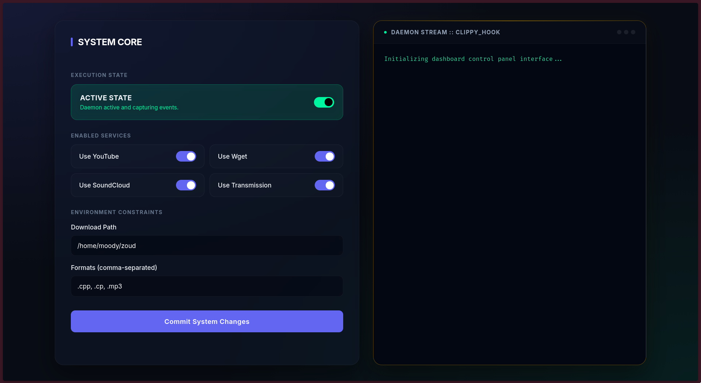

# youtube_clipboard_hook



A small open-source tool (Rust + helpers) that watches the system clipboard for links and automatically downloads recognized media links (YouTube, direct media files, torrents, etc.).

See the full documentation in the `docs/` folder.

Key components
- `src/` - Rust daemon, CLI and library code
- `service/` - example systemd unit files
- `app/` - small Python web UI and static views

Prerequisites
- `cargo` (Rust toolchain) for building the project
- `ffmpeg` (recommended for processing media)
- `libx11` (clipboard monitoring on X11)
- `yt-dlp` (YouTube downloads)
- `wget` (direct media downloads)
- `transmission-cli` (optional, for torrents)

Quickstart (recommended)

This project includes a Makefile that automates building the Rust binaries, preparing the Python app, installing files to your home directory, and managing systemd user services. Use the provided `make` targets or the convenience script `scripts/manage.sh`.

Common commands

- Build everything (Rust release build + Python app virtualenv):

```sh
make build
```

- Install built binaries, app files and systemd units to user locations:

```sh
make install
```

- Start the user systemd services (reloads unit files and starts the web UI and daemon):

```sh
make start
# or with systemctl directly:
systemctl --user daemon-reload
systemctl --user enable --now clippy_configure.service clippy_hook.service
```

- Stop the services:

```sh
make stop
# or
systemctl --user stop clippy_hook.service clippy_configure.service
```

- Run the full workflow (stop, install, start):

```sh
make run
```

- Clean build artifacts and stop services:

```sh
make clean
```

Where files are installed by `make install`

- Binaries: `$(HOME)/.local/bin/` (e.g. `clippy_daemon`, `clippy_cli`, `clippy_app`)
- Python app files and virtualenv: `$(HOME)/.local/share/clippy/`
- Systemd user service units: `$(HOME)/.config/systemd/user/`
- Runtime config: `$(HOME)/.config/clippy_hook/config.json`

Notes and environment requirements

- Systemd user vs system service: the Makefile installs units into the user systemd directory (`~/.config/systemd/user/`) and uses `systemctl --user` to start/stop them. This does not require `sudo`.
- Clipboard monitoring on X11: the daemon service sets `DISPLAY=:0` and `XAUTHORITY=%h/.Xauthority` in its unit file. If you run a different X session or use Wayland, adjust the unit or run the daemon manually from a graphical session.
- PATH: ensure `~/.local/bin` is on your `PATH` so the installed `clippy_app` script and binaries are discoverable. For example, add this to your shell profile:

```sh
export PATH="$HOME/.local/bin:$PATH"
```

- Dependencies: install `yt-dlp`, `ffmpeg`, `wget`, `transmission-cli` and the Rust toolchain (`rustup`, `cargo`) via your package manager.

Running the web UI

After `make install` and `make start`, the web UI is started by the `clippy_configure.service` unit which runs `clippy_app` from `~/.local/bin`. You can also run the web UI manually for development:

```sh
cd app
python3 -m venv venv
source venv/bin/activate
pip install -r requirements.txt
python main.py
```

Debugging & logs

- Check the status of the services:

```sh
systemctl --user status clippy_hook.service clippy_configure.service
```

- View logs for the daemon:

```sh
journalctl --user -u clippy_hook.service -f
```

Configuration

- Copy or edit the example config at `config/config.json` to `~/.config/clippy_hook/config.json` before starting the services. The Makefile `install` target will copy it for you.

Convenience script

There is a helper script `scripts/manage.sh` that wraps the common `make` commands and provides `build|install|start|stop|run|clean|status` subcommands. To use it locally:

```sh
chmod +x scripts/manage.sh
./scripts/manage.sh install
./scripts/manage.sh start
```

Documentation
- Architecture: docs/architecture.md
- Setup & install: docs/setup.md
- Usage & examples: docs/usage.md
- Contributing: docs/contributing.md

For development notes and code layout, see the `src/` and `app/` folders.
